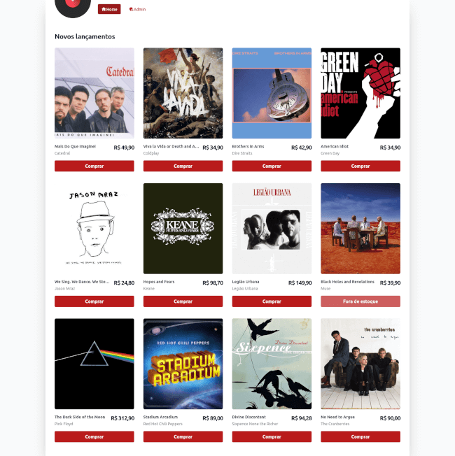

# Luna Records

<p align="center">
  
</p>

## Motivações

Este projeto é um exercício prático com o objetivo de colocar em portfólio um modelo de arquitetura de software e padrões de projeto comumente usados para desenvolvimento web.

## Tecnologias usadas

- Docker 20.10 e Docker Compose 2.15;
- NGINX com arquivos config automatizados;
- MariaDB com usuários e databases criados dinamicamente;
- API em PHP com Laravel 9 e Swoole, PHPUnit e PHP-CS-Fixer;
- UI em Vue.js 3 com Nuxt 3, TypeScript e TailwindCSS;
- CI com Github Actions;
- Git Hooks com Husky;
- Shell script, Node.js, entre outros...

## Instalação

> Obs: O tutorial a seguir tem como foco a instalação do projeto em ambiente de **produção**.

Faça o clone do repositório no seu ambiente onde o projeto será executado.

```bash
git clone git@github.com:vctrtvfrrr/luna-records.git
cd luna-records
```

Agora, precisamos definir as variáveis de ambiente e configurações de cada serviço que será executado.

### docker compose

Vamos começar pelas variáveis do docker compose:

```bash
# Diretório 'root'
cp .env.example .env # Duplique o arquivo de exemplo
vim .env # Abra o arquivo para edição
```

Aqui podemos definir o ambiente em que o projeto será executado. Altere a variável `SERVER_ENV` para `production`.

### API

Para definir as variáveis de ambiente da API, navegue até o diretório `api`, duplique o arquivo de exemplo e abra-o para edição:

```bash
# Diretório 'api'
cd api
cp .env.example .env
vim .env
```

Neste arquivo podem ser configurados muitos dados para o ambiente de desenvolvimento, mas para o ambiente de produção vamos manter tudo como está e seguir com as variáveis padrão com apenas dois pequenos ajustes: Altere a variável `APP_ENV` para `production` e `APP_DEBUG` para `false`.

### WEB

Para definir as variáveis de ambiente da interface web, navegue até a pasta `web`, na raiz do projeto, duplique o arquivo de exemplo e abra-o para edição:

```bash
# Diretório 'web'
cd web
cp .env.example .env
vim .env
```

Neste arquivo vamos manter os valores existentes, sem alterações.

### NGINX

Da mesma forma que nos serviços anteriores, no NGINX precisamos definir as variáveis de ambiente:

```bash
# Diretório 'nginx'
cd nginx
cp .env.example .env
vim .env
```

Neste arquivo também é recomendado manter os valores existentes, alterando apenas a variável `INTERCEPT_ERRORS` para o valor `on`, em ambiente de produção.

## Executando

O projeto utiliza o `docker compose` como orquestrador dos containers Docker.

> Obs: Nos comandos a seguir, para executar os containers em modo de produção, vamos especificar o arquivo `docker-compose.prod.yml` durante os comandos.

Para executar o projeto pela primeira vez, precisamos iniciar o banco de dados antes dos demais serviços (o primeiro start é um pouco mais demorado). Para isso vamos execurar:

```bash
docker compose -f docker-compose.prod.yml up -d mariadb
```

Em seguida, podemos simplesmente fazer o start de todos os demais serviços:

```bash
docker compose -f docker-compose.prod.yml up -d
```

Se todas as variáveis de ambiente tiverem sido configuradas corretamente e não ocorrer nenhum problema durante o processo de montagem das imagens, ao final do processo o projeto estará disponível através da seguinte URL: https://localhost.

> Obs: O projeto está configurado para ser executado via SSL (HTTPS). O certificado SSL é auto-assinado e gerado automaticamente durante a primeira execução do container `nginx`. Alguns browsers podem bloquear o acesso ao projeto por não reconhecer a autoridade do certificado. Neste caso, é possível contornar o problemas aceitando o risco de certificado inválido ou configurando um bypass.

## Testes

Como o objetivo deste tutorial é a execução do projeto em ambiente de produção, a configuração e execução dos testes em ambiente local não será abordada aqui.

Contudo, os testes são executados automaticamente, pelo [fluxo de CI no Github Actions](https://github.com/vctrtvfrrr/luna-records/actions), sempre que código novo é enviado para o repositório. Isso implica que, todo código publicado na branch `master` está devidamente testado.

## Licença

_Luna Records_ é uma loja fictícia e um projetode portfólio. Seu código-fonte é aberto e licenciado sob os termos da MIT. Para saber mais leia a [licença](LICENSE).
